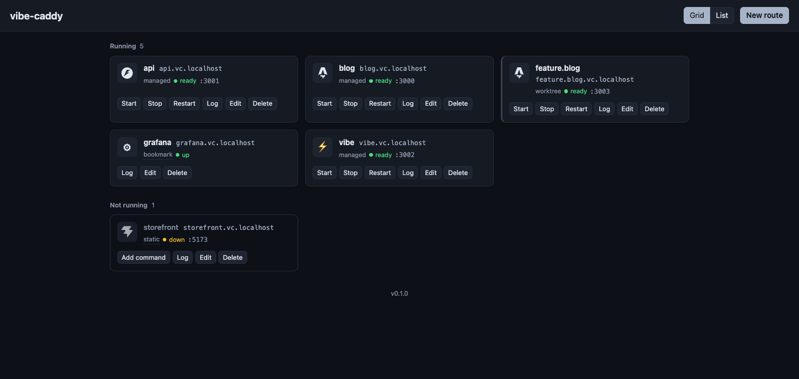

# vibe-caddy

Give every local dev server a stable `https://<name>.localhost` address with a trusted certificate.



**Status: early (0.1.0) and macOS only.**

## Why

Without vibe-caddy you have a wall of tabs: `localhost:3000`, `localhost:5173`, `localhost:8080`. You forget which is which, a restart moves one to a new port, and every browser warns about the certificate.

With it, each app has a name that stays put:

```
https://myapp.localhost
https://feature-auth.myapp.localhost     (a git worktree of the same app)
https://api.localhost
```

The certificate is trusted, WebSockets work, and an app that crashes is restarted. `*.localhost` needs no DNS setup, no `/etc/hosts` edit and no `/etc/resolver` file.

vibe-caddy is a stateless command-line tool plus a web dashboard. It runs no daemon of its own. It writes configuration for three things already on your Mac:

| Concern | Handled by |
| --- | --- |
| Name resolution | The macOS resolver, which sends `*.localhost` to loopback at any depth. |
| Ports 80 and 443, TLS, proxying, WebSockets | [Caddy](https://caddyserver.com), as a root LaunchDaemon bound to loopback, with certificates from its own local CA trusted in the System keychain. |
| Running your apps | launchd, one job per app: restart on crash, log redirection, PID tracking. |

Inspired by [local.vibe](https://github.com/graiz/local.vibe), and rewritten to replace firewall rules with Caddy. On macOS that tool routes traffic with pf redirect rules patched into `/etc/pf.conf`, plus dnsmasq and an `/etc/resolver` file. Caddy binds ports 80 and 443 directly instead, so vibe-caddy installs no firewall rules and no DNS server. vibe-caddy is macOS only; local.vibe also targets Windows.

## Requirements

- macOS.
- Caddy: `brew install caddy`.
- [uv](https://docs.astral.sh/uv/) 0.12.23 or newer. uv is required; there is no non-uv install path. uv fetches the Python 3.14 the project needs.

## Install and run your first app

```bash
git clone https://github.com/yolabingo/vibe-caddy
cd vibe-caddy
uv tool install .
sudo vibe-caddy setup
```

If `sudo` cannot find the command, use `sudo "$(which vibe-caddy)" setup`.

`setup` installs the Caddy LaunchDaemon, trusts Caddy's local CA in the System keychain, and starts the dashboard at `https://vibe.localhost`. It checks ports 80 and 443 first and changes nothing if either is held.

Then, in any project:

```bash
cd ~/code/myapp
vibe-caddy init -w auto      # detect the framework, write vibe-caddy.toml, start the app
vibe-caddy open myapp        # or visit https://myapp.localhost
```

Use `-w <framework>` (for example `-w vite`) to name the preset yourself. To review the command before anything runs, use plain `vibe-caddy init`, edit `vibe-caddy.toml`, then run `vibe-caddy start`.

## The one rule: bind `$PORT`

**Your start command must listen on the port vibe-caddy assigns. That port arrives in the environment as `$PORT`.**

vibe-caddy picks a port, writes it into the Caddyfile as the upstream, and exports it to your command. If the framework ignores `$PORT` and binds its own default (3000, 5173, 5000, 8000), it listens on a different port than the one the proxy targets. The app starts, launchd reports a running process, and the route answers nothing. `vibe-caddy list` shows the route as `starting`.

The `-w` presets handle this for 20 frameworks: each is a start command known to bind `$PORT`, and `init` prints the extra configuration the framework still needs (allowed hosts, trusted origins). See them all with:

```bash
vibe-caddy init -w list
```

If you write `cmd` by hand, pass `$PORT` explicitly, bind `127.0.0.1` (a bare `localhost` can resolve to `::1`, while Caddy dials `127.0.0.1`), and start with `exec` so launchd tracks the server and not a wrapper such as `npm run dev`. `express` and `go` presets cannot pass the port; your code must read `PORT` itself.

### Frameworks that must be told about the hostname

Several dev servers reject a `Host` header they do not recognise, so the route
returns an error until you add one line to their config. `init -w <name>` prints
the relevant note; they are collected here because the failure looks like a
vibe-caddy problem rather than a framework setting.

| Framework | Add to |
| --- | --- |
| Django | `ALLOWED_HOSTS = [".localhost"]` in settings |
| Rails | `config.hosts << ".localhost"` in `config/environments/development.rb` |
| Vite, SvelteKit, React Router | `server: { allowedHosts: ['.localhost'] }` in the Vite config |
| Nuxt | `vite: { server: { allowedHosts: ['.localhost'] } }` in `nuxt.config` |
| Astro | `server: { allowedHosts: ['.localhost'] }` in `astro.config` |
| Next.js | `allowedDevOrigins: ['*.localhost']` in `next.config`, for HMR |

Angular is handled for you: its preset passes `--allowed-hosts <name>.localhost`.

## Reference

### `vibe-caddy.toml`

Lives at the project root. Unknown keys are an error. `start` searches the current directory and its parents.

| Field | Type | Default | Meaning |
| --- | --- | --- | --- |
| `name` | string | required | Route name, served at `https://<name>.localhost`. A lowercase DNS label, at most 63 characters. `local` and `localhost` are reserved. |
| `cmd` | string | required | Shell command that starts the dev server. Must bind `$PORT`. |
| `port` | integer | auto | Pin a port instead of taking one from 3000-3999. Ignored for git worktrees. |
| `icon` | string | none | Emoji or image URL shown in the dashboard. |
| `autostart` | boolean | `false` | Start the app at login. |
| `ws_origin_rewrite` | boolean | `true` | Rewrite `Origin` and `Host` to the upstream's on WebSocket upgrades. Next.js HMR needs this. |
| `reserve_ports` | table | empty | Extra ports your command binds. Key `foo` is exported as `$PORT_FOO`; `0` auto-assigns, a number pins. |

```toml
name = "myapp"
cmd = "exec ./node_modules/.bin/vite --host 127.0.0.1 --port $PORT --strictPort"

[reserve_ports]
websocket = 0   # exported as $PORT_WEBSOCKET
```

The command runs as `<your login shell> -lc "<cmd>"` in the directory holding the file, with `PORT`, `PORT_<KEY>`, `VIBE_ROUTE`, `VIBE_URL` and `VIBE_HOSTNAME` set. Output goes to `~/.local/state/vibe-caddy/log/<name>.log`. launchd restarts a command that exits non-zero, at most once every 10 seconds; a clean exit is not restarted.

Edit the file, then run `vibe-caddy restart <name>` to apply `cmd`, `icon`, `autostart` and `ws_origin_rewrite`. The assigned port is kept. A missing or broken file falls back to the last known-good command.

### Route types

| Type | Created by | Notes |
| --- | --- | --- |
| `managed` | `vibe-caddy start` | launchd runs the `cmd`. Survives `stop`; removed by `deregister`. |
| `worktree` | `vibe-caddy start` in a linked git worktree | A managed route with its own name and port. Removed by `deregister` or `prune`. |
| `static` | `vibe-caddy register <name> <port>` | Names a port whose process you run yourself. State is `up` or `down`. |
| `bookmark` | `vibe-caddy register <name> --url <url>` | Names an external URL. A 307 redirect by default; `--proxy` reverse-proxies it so the name stays in the address bar; `--insecure` accepts a self-signed upstream certificate. |

### Git worktrees

`vibe-caddy start` inside a linked worktree registers a separate route on its own port:

```
https://<branch-slug>.<app>.localhost
```

`<app>` is the `name` from the main checkout's `vibe-caddy.toml`. `<branch-slug>` is the branch name lowercased, with non-alphanumerics turned into hyphens and a leading `worktree-` removed; `--as <slug>` overrides it. `vibe-caddy prune` removes routes whose checkout is gone, and skips a route when the checkout's parent directory is also missing, so an unmounted volume does not wipe your routes.

### Commands

Run `vibe-caddy <command> --help` for options. Commands marked `sudo` need root.

| Command | What it does |
| --- | --- |
| `init [-w NAME] [--name N] [--cmd C] [-d PATH] [--overwrite]` | Write `vibe-caddy.toml`. With `-w`, also register and start the app. `-w list` prints the presets. |
| `start [name] [--as SLUG]` | Register (from `vibe-caddy.toml`) and start an app. |
| `stop <name>`, `restart <name>` | Stop or restart a managed app. The route stays registered. |
| `list` | Every route and its live state: `ready`, `starting`, `crashed`, `stopped`, `up`, `down`. |
| `status` | Whether Caddy is serving, and a route count. Exits 1 if Caddy is down or not ours. |
| `open [name]` | Open a route, or the dashboard, in the browser. |
| `logs <name> [-n N] [-f]` | Show or follow a managed app's log. |
| `register <name> [port] [--url U] [--proxy] [--insecure] [--icon I]` | Add a static route or a bookmark. |
| `update <name> [--port N] [--cmd C] [--icon I] [--autostart]` | Change a route in place. `--port 0` assigns a free port. |
| `deregister <name>`, `deregister --all [-y] [--include-dashboard]` | Remove routes, stopping managed ones first. |
| `prune` | Remove worktree routes whose checkout is gone. |
| `reload` | Regenerate the Caddyfile and reload Caddy. |
| `caddyfile [--validate]` | Print the generated Caddyfile, or validate it. |
| `sudo caddy start\|stop\|restart` | Control the Caddy LaunchDaemon. |
| `dashboard install` | Register the dashboard at `https://vibe.localhost`. |
| `sudo setup [--no-trust]` | Install the LaunchDaemon, trust the CA, start the dashboard. |
| `sudo uninstall` | Remove the LaunchDaemon and untrust the CA. |
| `doctor` | Check DNS, listeners, daemon, certificates and every route, and print a fix for each failure. Exits 1 on failure. |

### Runtime files

vibe-caddy follows the XDG Base Directory spec. The data directory holds what cannot be regenerated; the state directory holds everything derived and is safe to delete.

| Path | Purpose |
| --- | --- |
| `~/.local/share/vibe-caddy/registry.json` | Source of truth: every route, plus dashboard preferences. |
| `~/.local/share/vibe-caddy/caddy/` | Caddy's data, including its local CA. |
| `~/.local/state/vibe-caddy/Caddyfile` | Generated Caddy configuration. Do not edit it; every change overwrites it. |
| `~/.local/state/vibe-caddy/launchd/` | Generated launchd plist for each managed app. |
| `~/.local/state/vibe-caddy/log/` | `<name>.log` for each app, plus Caddy's own logs (`caddy.log`, `caddy.out.log`, `caddy.err.log`). |
| `/Library/LaunchDaemons/dev.vibe-caddy.caddy.plist` | The root LaunchDaemon that runs Caddy. |
| `~/Library/LaunchAgents/dev.vibe-caddy.<name>.plist` | Symlink to an app's plist; exists only when `autostart = true`. |

`$XDG_DATA_HOME` and `$XDG_STATE_HOME` relocate the first two directories. If you set them, preserve them through sudo: `sudo --preserve-env=XDG_STATE_HOME,XDG_DATA_HOME vibe-caddy setup`.

`sudo vibe-caddy uninstall` removes the LaunchDaemon and the trusted CA. It leaves both directories in place; delete them by hand if you want them gone. Remove the CLI with `uv tool uninstall vibe-caddy`.

Earlier releases used `~/.vibe-caddy`. `sudo vibe-caddy setup` migrates its registry and CA to the new layout and leaves the old directory behind. A project file named `vibe.toml` is no longer read; rename it with `mv vibe.toml vibe-caddy.toml`.

### Troubleshooting

Start with `vibe-caddy doctor`.

| Symptom | Cause and fix |
| --- | --- |
| Setup says port 80 or 443 is held. | Setup changed nothing and named the holder. A Docker container publishing those ports is the usual cause; stop it (`docker stop <name>`) and re-run `sudo vibe-caddy setup`. |
| `status` says `not ours`, or setup reports a foreign Caddy on port 2019. | vibe-caddy refuses to reconfigure a Caddy it did not start. Stop the other one (a stray `caddy run`, or a container publishing 2019), then re-run setup. |
| `doctor` reports a `daemon config path` mismatch. | Custom `XDG_*` variables were lost under plain `sudo`. Re-run setup with `--preserve-env` as shown above. |
| The browser warns about the certificate. | The CA is not trusted. Run `sudo vibe-caddy setup` again without `--no-trust`, then restart the browser. |
| The app starts but nothing answers. | Almost always the `$PORT` rule. Read `vibe-caddy logs <name>`, see which port the framework announced, pass `$PORT` explicitly, then `vibe-caddy restart <name>`. `crashed` means the process exited; the log says why. |
| Vite says "Blocked request. This host is not allowed." | Set `server.allowedHosts: ['.localhost']` in the Vite config. Other frameworks have a similar setting; `init` prints it. |
| A name shows the unknown-name page or a 404. | The route is not registered, or the name is not lowercase. Check `vibe-caddy list`. |

## Limitations

- macOS only. It depends on launchd, the macOS resolver and the System keychain.
- Early software (0.1.0). Expect rough edges and changes.
- `sudo vibe-caddy setup` is needed once, to install the LaunchDaemon and add the CA to the System keychain.
- Caddy must own ports 80 and 443, so vibe-caddy conflicts with anything else holding them. A Docker reverse proxy is the common case.
- The dashboard API is unauthenticated, and creating a route runs a shell command as you. By design it binds `127.0.0.1` only and rejects state-changing requests from cross-site or untrusted-origin browser contexts. Any local process can still reach it, so it assumes a single-user machine. Caddy also listens on loopback only, so your dev servers are not exposed to the LAN.

## Contributing

Run `just ci` before sending a change; it runs the format check, type check, tests and dependency audit. `CLAUDE.md` has the module map, test rules and `just` tasks.

## License

MIT. See [LICENSE](LICENSE).
